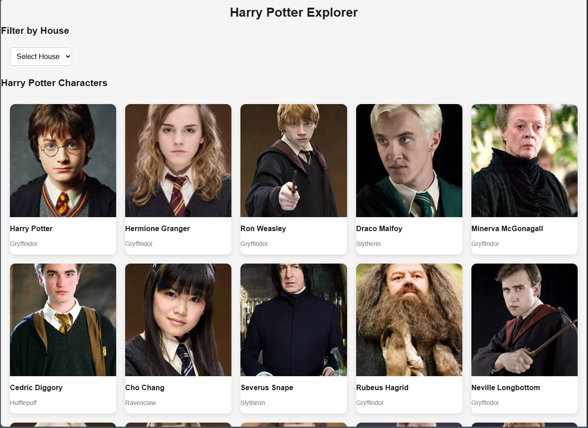
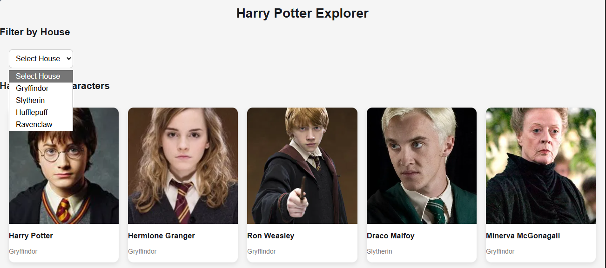
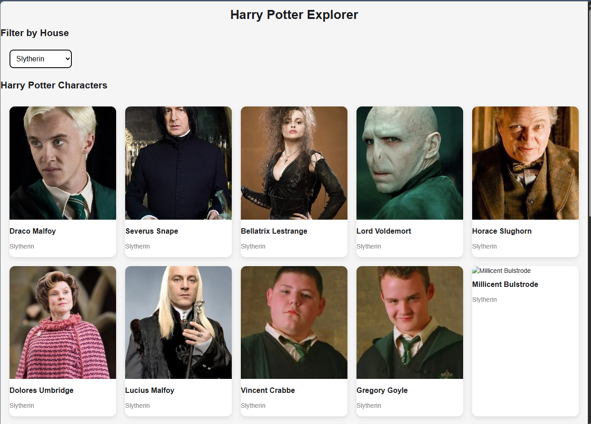

# Harry Potter Character Explorer 

## Description

This project is an Angular application built as part of COMP 3133 Lab Test 2.
The application consumes a public API to display Harry Potter character data, allowing users to browse, filter, and view detailed information about characters.

---

##  Features Implemented

*  Display a list of Harry Potter characters
*  Filter characters by house (Gryffindor, Slytherin, Hufflepuff, Ravenclaw)
*  View detailed information for each character
*  API integration using Angular HttpClient
*  State management using Angular Signals
*  Clean and responsive UI with CSS

---

##  Technologies Used

* Angular (latest version)
* TypeScript
* Angular HttpClient
* Angular Signals
* HTML & CSS

---

##  API Used

Harry Potter API:
https://hp-api.onrender.com/

---

##  Screenshots

### 1. Character List

Displays all characters with image, name, and house.


### 2. Filter by House

Dropdown filter to display characters based on selected house.



### 3. Character Details

Detailed page showing character information including:

* Species
* House
* Wizard status
* Ancestry
* Wand (wood, core, length)
* Actor


---

##  How to Run the Project

1. Clone the repository:

```bash
git clone https://github.com/your_username/YOUR_REPO_NAME.git
```

2. Navigate into the project folder:

```bash
cd your_project_name
```

3. Install dependencies:

```bash
npm install
```

4. Run the application:

```bash
ng serve
```

5. Open in browser:

```
http://localhost:4200
```

---

##  Live Deployment

(Insert your Vercel / Render link here)

---

##  Project Structure

* components/

  * characterlist
  * characterfilter
  * characterdetails
* services/

  * character.service.ts
* models/

  * character.ts

---

##  Summary

This project demonstrates the use of Angular to build a dynamic, data-driven web application using a public API. It includes component-based architecture, routing, API integration, and user interaction features such as filtering and navigation.

---

## Developed by:

Amelework Murti
